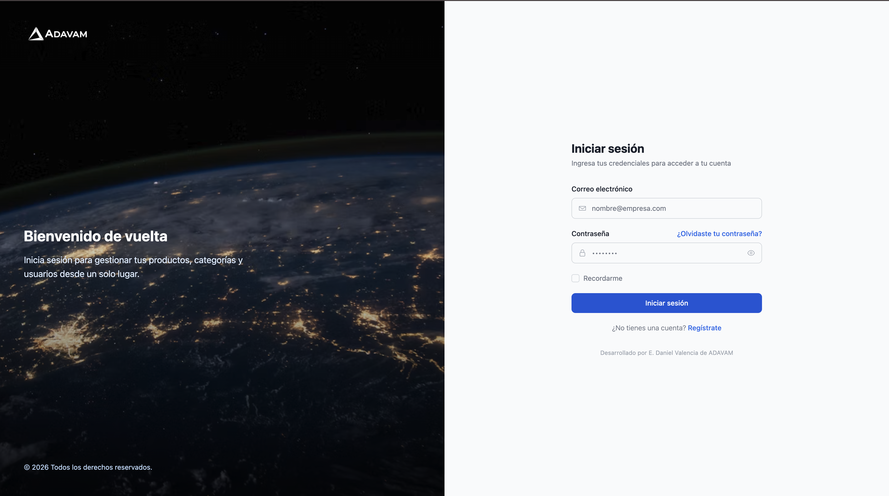

<div align="center">
  

  # Login Angular Frontend

  Aplicación frontend de autenticación y panel administrativo construida con **Angular 22**.

  

  <br/>

  <div align="center">
  <a href="https://github.com/edaniel-valencia/login-backend-with-angular">
    
  </a>
</div>

</div>

---

## Tabla de contenidos

- [Requisitos previos](#requisitos-previos)
- [Instalación de NVM (Node Version Manager)](#instalación-de-nvm-node-version-manager)
- [Instalación de Node.js](#instalación-de-nodejs)
- [Instalación de pnpm](#instalación-de-pnpm)
- [Instalación de Angular CLI](#instalación-de-angular-cli)
- [Clonar e instalar el proyecto](#clonar-e-instalar-el-proyecto)
- [Configuración de variables de entorno](#configuración-de-variables-de-entorno)
- [Preconfiguración del proyecto](#preconfiguración-del-proyecto)

- [Scripts disponibles](#scripts-disponibles)
- [Estructura del proyecto](#estructura-del-proyecto)

---

## Requisitos previos

Este proyecto utiliza:

| Herramienta  | Versión requerida |
|--------------|--------------------|
| Node.js      | `v24.15.0` (ver [.nvmrc](.nvmrc)) |
| Angular      | `^22.1.3`          |
| Angular CLI  | `^22.1.6`          |
| pnpm         | `11.x` (gestor de paquetes) |

---

## Instalación de NVM (Node Version Manager)

NVM permite instalar y alternar entre múltiples versiones de Node.js en tu máquina, lo cual es muy útil ya que este proyecto fija una versión específica en el archivo `.nvmrc`.

### macOS / Linux

```bash
curl -o- https://raw.githubusercontent.com/nvm-sh/nvm/v0.40.1/install.sh | bash
```

Luego recarga la terminal o ejecuta:

```bash
source ~/.zshrc   # o ~/.bashrc si usas bash
```

Verifica la instalación:

```bash
nvm --version
```

### Windows

En Windows se recomienda usar [nvm-windows](https://github.com/coreybutler/nvm-windows/releases). Descarga el instalador `nvm-setup.exe`, ejecútalo y reinicia la terminal.

```powershell
nvm --version
```

---

## Instalación de Node.js

Con NVM ya instalado, dentro de la carpeta del proyecto (donde está el archivo `.nvmrc`) ejecuta:

```bash
nvm install    # instala la versión declarada en .nvmrc (v24.15.0)
nvm use        # activa esa versión en la terminal actual
```

Verifica que la versión activa sea la correcta:

```bash
node -v   # debe mostrar v24.15.0
```

> Tip: puedes ejecutar `nvm alias default 24.15.0` para que esa sea la versión de Node por defecto en nuevas terminales.

---

## Instalación de pnpm

Este proyecto usa **pnpm** como gestor de paquetes (existen `pnpm-lock.yaml` y `pnpm-workspace.yaml` en la raíz). Instálalo globalmente con Corepack (viene incluido con Node.js) o con npm:

```bash
# Opción recomendada: Corepack (incluido en Node)
corepack enable
corepack prepare pnpm@latest --activate

# Alternativa: instalación global vía npm
npm install -g pnpm
```

Verifica la instalación:

```bash
pnpm -v
```

---

## Instalación de Angular CLI

Instala Angular CLI de forma global para poder usar el comando `ng` en cualquier lugar:

```bash
pnpm add -g @angular/cli@22
```

Verifica la versión instalada:

```bash
ng version
```

> No es estrictamente necesario tenerlo global: el proyecto ya incluye `@angular/cli` como dependencia de desarrollo y puede invocarse con `pnpm ng <comando>` o a través de los scripts de `package.json`.

---

## Clonar e instalar el proyecto

```bash
git clone <url-del-repositorio>
cd login-frontend-with-angular

# Usar la versión de Node definida en el proyecto
nvm use

# Instalar dependencias
pnpm install
```

---

## Configuración de variables de entorno

El proyecto usa un archivo `.env` en la raíz para inyectar variables en los archivos de entorno de Angular (`src/environments`) antes de cada build o `serve`, mediante el script [`scripts/set-env.js`](scripts/set-env.js).

1. Copia el archivo de ejemplo:

   ```bash
   cp .env.example .env
   ```

2. Edita `.env` con la URL de tu API:

   ```dotenv
   API_ENDPOINT=http://localhost:3001/
   ```

Este script se ejecuta automáticamente antes de `start`, `build` y `watch` (ver sección de scripts) y genera:

- `src/environments/environment.development.ts` → cuando se corre en modo desarrollo.
- `src/environments/environment.ts` → cuando se corre con `production`.

> Estos archivos generados **no deben editarse manualmente**, ya que se sobrescriben en cada ejecución.

---

## Preconfiguración del proyecto

Antes de levantar la aplicación por primera vez:

1. **Node y pnpm activos**: confirma con `node -v` y `pnpm -v` que coinciden con las versiones requeridas.
2. **Variables de entorno**: asegúrate de tener el archivo `.env` creado (paso anterior).
3. **Dependencias instaladas**: `pnpm install` debe haberse ejecutado sin errores.
4. **Backend disponible**: la app espera una API en el `API_ENDPOINT` configurado (por defecto `http://localhost:3001/`). Sin el backend corriendo, el login y las peticiones fallarán.

---

## Scripts disponibles

| Comando          | Descripción |
|------------------|-------------|
| `pnpm start`     | Genera el entorno de desarrollo y levanta `ng serve` en `http://localhost:4200/` |
| `pnpm build`     | Genera el entorno de producción y compila la app en `dist/` |
| `pnpm watch`     | Compila en modo desarrollo con recompilación automática (`--watch`) |
| `pnpm test`      | Genera el entorno y ejecuta las pruebas unitarias con Karma/Jasmine |

Ejemplo para arrancar el proyecto en desarrollo:

```bash
pnpm start
```

Luego abre [http://localhost:4200](http://localhost:4200) en el navegador. La aplicación se recarga automáticamente al detectar cambios en el código fuente.

---

## Estructura del proyecto

```
src/
├── app/
│   ├── admin/          # Módulo administrativo (usuarios, roles, productos, categorías)
│   ├── components/     # Componentes reutilizables del dashboard
│   ├── login/           # Pantalla de inicio de sesión
│   ├── sig-in/          # Pantalla de registro
│   ├── page/            # Layout público (header, footer, home)
│   ├── shared/          # Componentes compartidos (spinner, etc.)
│   └── utils/           # Interceptores y utilidades
├── assets/              # Imágenes y recursos estáticos
└── environments/        # Configuración de entornos (generada por scripts/set-env.js)
```

---

## Ayuda adicional

Para más comandos de Angular CLI:

```bash
ng help
```

O consulta la documentación oficial: [Angular CLI Overview and Command Reference](https://angular.dev/tools/cli).
